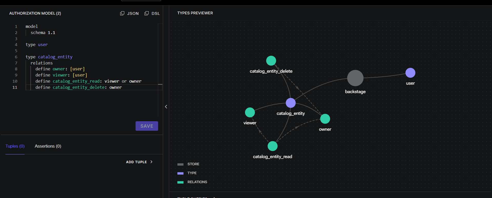
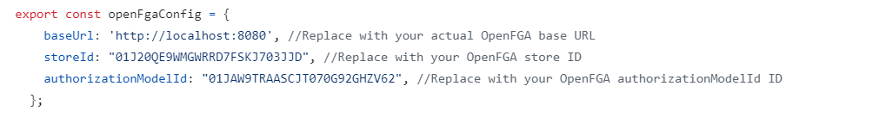
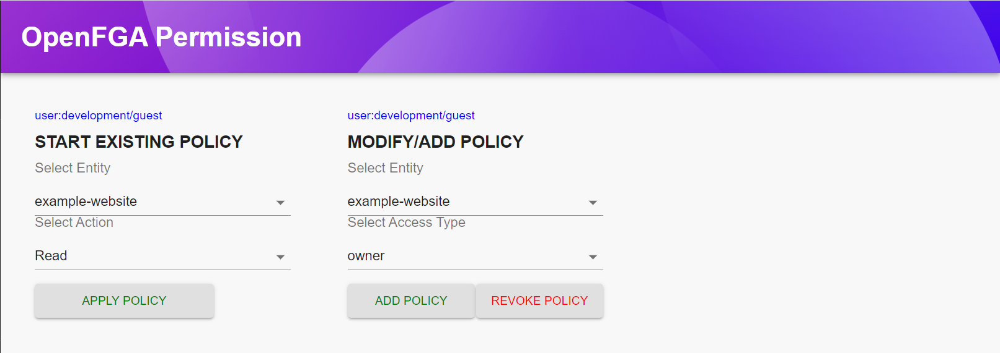
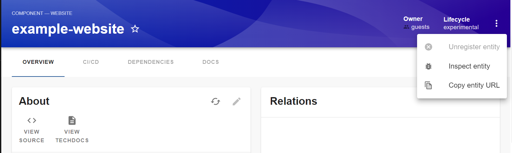
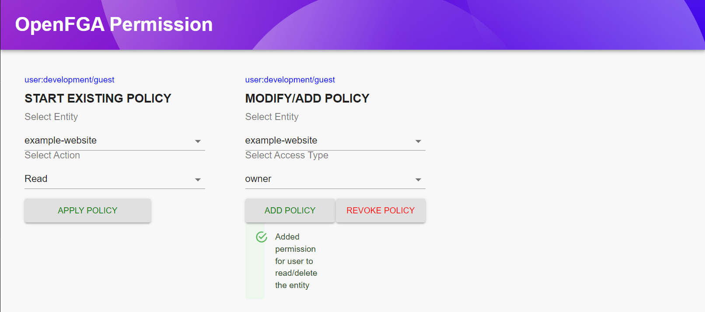
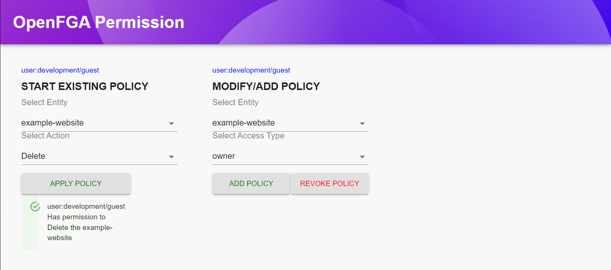
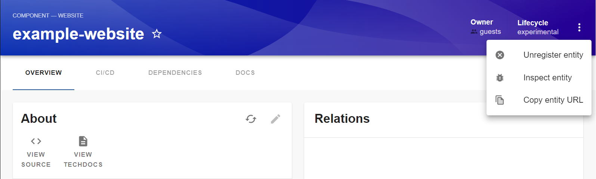
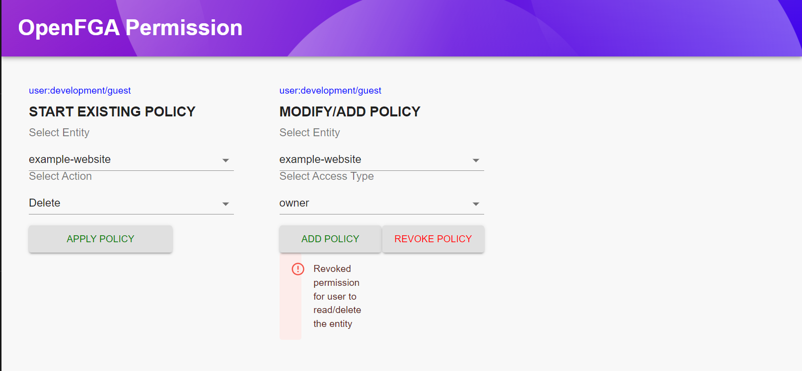

# openfga

This plugin wraps around the Backstage Permission Framework and uses the OPENFGA client to evaluate policies. It will send a request to OPENFGA with the permission and identity information, OPENFGA will then evaluate the policy and return a decision, which is then passed back to the Permission Framework.

## Installation

````bash
yarn add --cwd packages/backend @infosys_ltd/openfga-plugin-backstage

Your plugin will be added to the example app in this repository, meaning you'll be able to access it by running yarn start in the root directory, and then navigating to /openfga-permission-policy.

Make the following changes to the `packages/backend/src/index.ts` file in your Backstage project.

```diff
import { createBackend } from '@backstage/backend-defaults';
import { permissionModuleACatalogPolicy } from '../../../plugins/openfga/src/module';

const backend = createBackend();
backend.add(import('@backstage/plugin-app-backend/alpha'));
backend.add(import('@backstage/plugin-auth-backend'));
// ..... other plugins
+ backend.add(permissionModuleACatalogPolicy)

comment following line:

// permission plugin
backend.add(import('@backstage/plugin-permission-backend/alpha'));
// backend.add(
//   import('@backstage/plugin-permission-backend-module-allow-all-policy'),
// );
````

## Example Catalog Permission policy using openFGA

Lets take a scenario a role based access for backstage catalog delete/ungersitering an entity

Rules:

- A user who have OWNER access can read and delete the entity
- A user who have VIEWER access can only read the entity not delete the entity

## CREATE A MODEL IN OPENFGA PLAYGROUND



## RUNNING OPENFGA SERVER AND SETUP

TO run a openfga in your local please follow below steps

OpenFGA is available on Dockerhub, so you can quickly start it using the in-memory datastore by running the following commands:

```
docker pull openfga/openfga
docker run -p 8080:8080 -p 4000:4000 openfga/openfga run
```

## ACCESSING OPENFGA FEATURES

OPENFGA Model and Features can be accessable with many ways please [visit](https://openfga.dev/docs/getting-started/create-store)

In this following example OPENFGA API is used

STEP 1: CREATE A STORE

```
REQUEST TYPE : POST

URL :  http://localhost:8080/stores

REQUEST BODY:

{
  "name": "backstage"
}

EXAMPLE RESPONSE BODY:
{
"id": "01J289TDYQ1WH9RTMQD46K7ANC",
"name": "backstage",
"created_at": "2024-07-08T04:32:20.951446991Z",
"updated_at": "2024-07-08T04:32:20.951446991Z"
}

```

STEP 2 : GET A STORE

```
REQUEST TYPE : GET

URL : http://localhost:8080/stores

EXAMPLE RESPONSE BODY:

{
"stores":[
{
"id": "01J289TDYQ1WH9RTMQD46K7ANC",
"name": "backstage",
"created_at": "2024-07-08T04:32:20.951446991Z",
"updated_at": "2024-07-08T04:32:20.951446991Z",
"deleted_at": null
}
],
"continuation_token": ""
}
```

STEP 3 : ADDING AUTHORIZATION MODEL FOR CATALOG DELETE

```
REQUEST TYPE : POST

URL: http://localhost:8080/stores/{store_id}/authorization-models

REQUEST BODY:

{
  "schema_version": "1.1",
  "type_definitions": [
    {
      "type": "user",
      "relations": {},
      "metadata": null
    },
    {
      "type": "catalog_entity",
      "relations": {
        "owner": {
          "this": {}
        },
        "viewer": {
          "this": {}
        },
        "catalog_entity_read": {
          "union": {
            "child": [
              {
                "computedUserset": {
                  "relation": "viewer"
                }
              },
              {
                "computedUserset": {
                  "relation": "owner"
                }
              }
            ]
          }
        },
        "catalog_entity_delete": {
          "computedUserset": {
            "relation": "owner"
          }
        }
      },
      "metadata": {
        "relations": {
          "owner": {
            "directly_related_user_types": [
              {
                "type": "user"
              }
            ]
          },
          "viewer": {
            "directly_related_user_types": [
              {
                "type": "user"
              }
            ]
          },
          "catalog_entity_read": {
            "directly_related_user_types": []
          },
          "catalog_entity_delete": {
            "directly_related_user_types": []
          }
        }
      }
    }
  ]
}

EXAMPLE RESPONSE BODY:

{
"authorization_model_id": "01J289WKKTE286M800HJBGYX5K"
}

```

## USING OPENFGA FRONT END PLUGIN

Before start accessing openFGA plugin in ui make sure you have updated following values in [openFgaConfig.ts] (https://github.com/Infosys/openfga-plugin-backstage/blob/master/plugins/openfga/src/openFgaConfig.ts)



HOME SCREEN:



BEFORE APPLYING POLICY:

A guest user not able to unregister a entity



ADD POLICY:



APPLY POLICY:



AFTER APPLYING POLICY:

A guest user able to unregister a entity



REVOKE POLICY:


